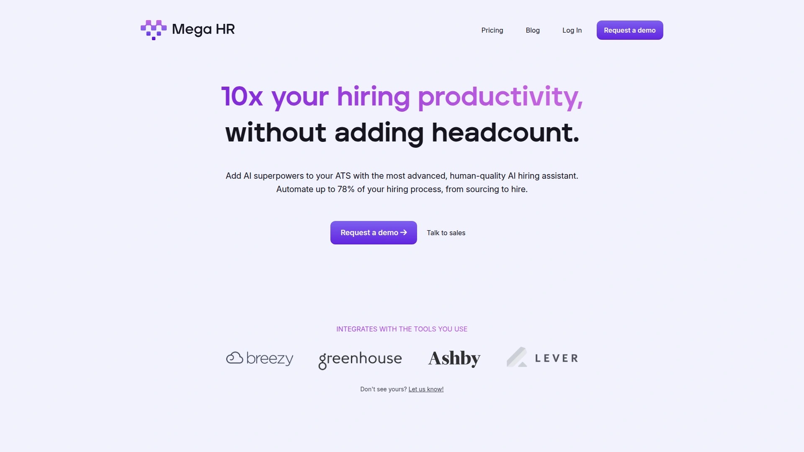
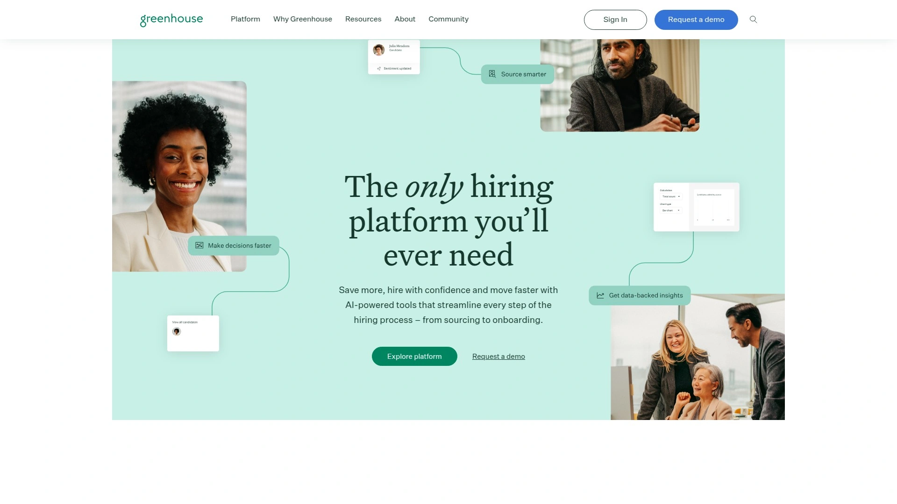
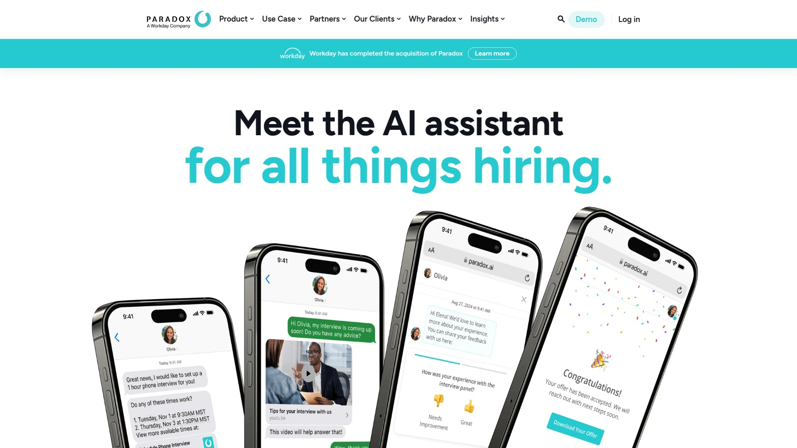
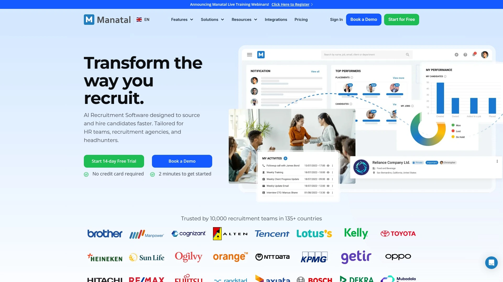
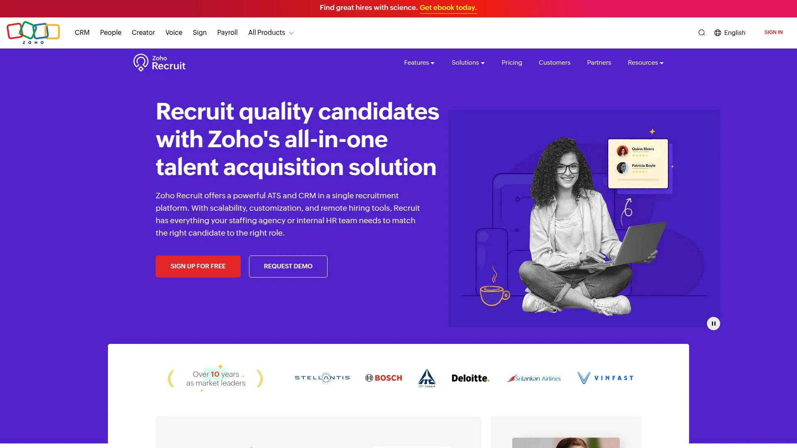
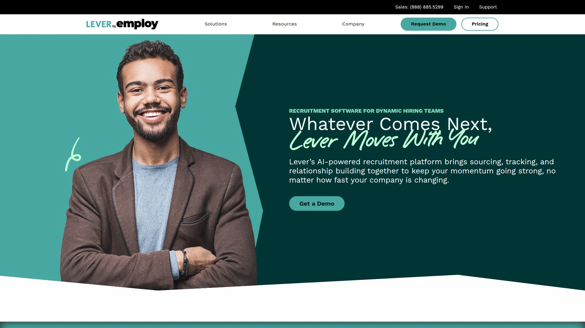

# 2025's Top 8 Best AI-Powered Recruitment Platforms

Hiring managers drowning in 500 resumes for one position, spending 40 hours weekly scheduling interviews across six time zones, and still somehow missing perfect candidates buried in application pile 247. Traditional recruiting means manually screening every resume, copy-pasting candidate information between systems, playing email tag for two weeks just to schedule one interview, and wondering if you're unconsciously filtering out great talent through bias you don't even realize exists. AI-powered recruitment platforms eliminate this chaos by automatically screening resumes against job requirements in seconds, scheduling interviews through calendar sync without human coordination, generating interview notes and summaries so you focus on conversations instead of typing, and flagging bias in job descriptions or screening processes before they harm your diversity goals. Whether you're hiring one person quarterly or 500 people monthly, these platforms compress weeks of administrative recruiting work into automated background processes while surfacing the best candidates faster than manual methods ever could.

## **[Mega HR](https://megahr.com)**

AI hiring manager "Megan" automating 78% of recruitment workflows with advanced ATS integration and bias analysis.

Mega HR introduces Megan, an AI hiring manager that functions as a virtual team member handling the tedious, time-consuming parts of recruitment that traditionally consume recruiter hours. The platform positions itself as adding "AI superpowers" to existing applicant tracking systems rather than replacing them, creating a complementary layer of automation that works with whatever ATS infrastructure you already have in place.

The automation scope reaches 78% of typical hiring workflows according to Mega HR's claims. Megan handles candidate screening at scale by analyzing resumes against specific criteria you define—including requirements on or off the formal job description. This nuanced screening catches candidates who might not check every box but possess transferable skills or unique qualifications worth considering. You specify what matters most, and Megan surfaces the best options without you manually reading hundreds of applications.

Interview scheduling becomes completely hands-off through custom scheduling links with full Google and Microsoft calendar synchronization. You can manage it yourself, share links with candidates for self-scheduling, or delegate entirely to Megan who coordinates availability, sends invitations, and handles rescheduling when conflicts arise. This eliminates the exhausting email chains where five people try finding one shared hour across three weeks.

Real-time note-taking during interviews frees you to focus on actual conversations rather than frantically typing while candidates talk. Megan transcribes discussions, generates detailed summaries highlighting key points, and shares insights about candidate responses that inform hiring decisions. The post-interview debriefs become effortless—you review AI-generated summaries instead of deciphering hastily scribbled notes or relying on memory from interviews conducted days ago.

ATS integration syncs bidirectionally in real-time, meaning jobs, candidates, pipeline stages, interview schedules, and notes update automatically between your existing ATS and Mega HR without manual data entry. This eliminates the tedious double-work that plagues systems requiring information entry in multiple places. Changes made in either system instantly reflect everywhere, maintaining single source of truth across platforms.

Built-in third-party AI bias analysis examines hiring processes for age, sex, race, disability, gender identity, sexual orientation, religion, and political bias. The system flags potentially discriminatory language in job descriptions, identifies screening criteria that might inadvertently exclude protected groups, and highlights patterns in hiring decisions that could indicate unconscious bias. This proactive bias detection helps organizations build fairer, more inclusive hiring processes rather than discovering discrimination problems after legal complaints arise.

## **[Workable](https://www.workable.com)**

Comprehensive recruitment platform with AI job posting tools, screening assistant, and 400+ million candidate database access.

Workable delivers end-to-end recruitment capabilities spanning sourcing, applicant tracking, interviewing, and HR workflow management. The platform's AI job posting tool stands out for ease of use and output quality, incorporating generative AI to create compelling job descriptions with customizable tones and version control. You specify the role, select appropriate tone (professional, casual, enthusiastic), and receive multiple versions optimizing for different audiences or platforms.

The AI Screening Assistant scores and summarizes candidate-job fit automatically, analyzing resumes and applications against requirements to generate compatibility scores with explanations. Instead of reading 200 resumes to shortlist 10 candidates, you review AI-generated summaries identifying the strongest matches with reasoning about why each candidate rates highly. This screening dramatically accelerates the initial filtering stage where most recruiter time traditionally gets consumed.

Salary Estimator provides competitive pay ranges for US and UK positions based on market data, helping you set realistic compensation before posting jobs. The estimates consider location, experience level, and current market conditions, preventing the common problem of posting positions with below-market salaries that attract zero qualified applicants.

The platform includes built-in video interviewing tools with AI capabilities, eliminating need for separate video interview platforms. Cognitive and personality assessments evaluate candidates beyond resume credentials, providing insights into work styles, problem-solving approaches, and cultural fit indicators that traditional applications miss completely.

Access to Workable's talent pool with 400+ million profiles enables passive candidate sourcing beyond people actively applying. The AI-powered sourcing identifies potential candidates from this database who match job requirements even if they haven't applied, expanding your talent pipeline dramatically. You can post jobs with one click to 200+ job boards simultaneously, maximizing visibility without manually submitting to each site.

Unconscious bias reduction comes through anonymized screening features that hide identifying candidate information during sourced and applied stages. Recruiters evaluate qualifications without seeing names, photos, addresses, or other details that might trigger unconscious preferences based on demographics rather than capabilities.

Over 290 integrations connect Workable with existing HR tech stacks, plus API support for custom integrations. Offer management features let you create offer letters and collect e-signatures within the platform. Pricing varies based on company size and feature requirements, with additional fees for texting, video interviews, transcription, and salary estimator add-ons.

## **[Greenhouse](https://www.greenhouse.com)**

Enterprise-grade ATS with AI content generation, structured hiring workflows, and industry-leading DEI analytics.

Greenhouse focuses on data-driven hiring through structured interview processes, comprehensive analytics, and AI-powered content generation that speeds job postings, candidate outreach, and interview question creation. The platform excels at enforcing hiring consistency across teams, ensuring every candidate receives comparable evaluation rather than arbitrary assessments varying by interviewer mood.

AI content generation tools reduce bias and maintain brand consistency while accelerating content creation. The system generates job descriptions incorporating inclusive language, creates personalized candidate outreach messages that don't sound robotic, and suggests interview questions aligned with role requirements and company values. This automation particularly helps smaller teams without dedicated recruitment marketing resources.

Robust analytics and reporting provide visibility into hiring funnel performance, time-to-hire metrics, offer acceptance rates, source effectiveness, and demographic diversity throughout pipelines. The DEI analytics specifically track representation across hiring stages, flagging where certain groups drop off disproportionately and helping identify process improvements addressing disparities.

Structured hiring methodology guides teams through creating scorecards, standardized interview questions, and evaluation rubrics ensuring consistent candidate assessment. This structure reduces the "gut feeling" hiring that often reflects unconscious bias rather than objective qualification evaluation. Multiple interviewers independently score candidates on defined criteria, then collective scores inform decisions.

The comprehensive ATS functionality handles requisition management, candidate pipeline tracking, interview scheduling, offer approvals, and onboarding handoffs. Greenhouse positions itself as the system of record for entire recruiting operations, not just one piece of the hiring puzzle.

Integration ecosystem connects with hundreds of tools including background check providers, assessment platforms, video interview solutions, and HRIS systems. The open API enables custom integrations for organizations with specialized requirements. Pricing targets mid-market to enterprise customers with subscription models based on company size and feature tiers. Setup complexity is higher than simpler platforms, requiring dedicated implementation time and ongoing process management.

## **[HireVue](https://www.hirevue.com)**

Video interviewing specialist with AI assessments predicting job performance for high-volume hiring scenarios.

HireVue pioneered AI-powered video interviewing, using technology to evaluate candidate responses, body language, and speech patterns during recorded or live video interviews. The platform combines video interviewing infrastructure with AI-driven assessments that claim to predict job performance based on how candidates answer questions and present themselves.

The system supports both pre-recorded video interviews where candidates record responses to standardized questions at their convenience, and live video interviews with real-time interaction. Pre-recorded interviews let candidates complete screenings on their schedules while ensuring every applicant answers identical questions, creating standardized comparison data. Recruiters review recordings at their convenience, compressing hours of interviewing into concentrated review sessions.

AI assessments analyze candidate responses beyond just the verbal content. The technology evaluates vocal tone, word choice, response structure, facial expressions, and engagement indicators to generate competency scores. These scores claim to predict traits like conscientiousness, resilience, learning agility, and communication skills that traditional resumes don't capture.

Structured interviewing tools provide standardized interview guides ensuring consistency and reducing bias. Every candidate faces identical evaluation criteria rather than varying questions and assessments depending on which interviewer they get. This consistency improves legal defensibility if hiring decisions ever face discrimination challenges.

HireVue particularly suits high-volume hiring scenarios—call centers, retail, hospitality, seasonal workers—where companies need to screen hundreds or thousands of candidates quickly. The ability to have candidates complete video screenings independently at scale eliminates the logistical nightmare of scheduling 500 phone screens. However, the AI assessment component remains controversial, with critics arguing that judging candidates based on facial expressions and vocal patterns risks amplifying bias rather than reducing it.

Pricing operates on enterprise subscription models with costs scaling based on hiring volume and features used. The platform integrates with major ATS systems including Greenhouse, Workday, SAP SuccessFactors, and others. Companies using HireVue typically employ it for specific high-volume roles rather than all hiring.

## **[Paradox (Olivia)](https://www.paradox.ai)**

Conversational AI recruiting assistant automating candidate engagement, screening, and scheduling through chat interfaces.

Paradox's AI assistant "Olivia" handles front-end recruiting through natural text-based conversations on career sites, mobile chat, SMS, or WhatsApp. Candidates interact with Olivia like texting a helpful recruiter who's available 24/7, getting questions answered, finding relevant jobs, completing applications via chat, and scheduling interviews without waiting for human responses.

The conversational approach particularly suits hourly and frontline hiring where speed and accessibility matter more than lengthy application processes. A retail associate candidate can message Olivia at midnight, upload their resume through chat, answer screening questions about availability and work authorization, and book an interview slot for the next day—all within 10 minutes without touching traditional application forms.

Olivia handles screening questions at scale, asking about availability, location preferences, work authorization, basic experience, and role-specific qualifications through natural conversation flows. Qualified candidates automatically advance to interview scheduling while those not meeting requirements receive polite rejections explaining why they don't fit current openings. This immediate feedback improves candidate experience compared to application black holes where people never hear back.

Interview scheduling syncs with hiring manager calendars, presenting available slots to candidates who book times that work for them. Olivia sends reminders, handles rescheduling when conflicts arise, and even initiates onboarding steps for new hires like completing paperwork or scheduling orientation sessions.

Companies deploying Olivia report dramatic improvements in hiring metrics. One organization increased application completion rates from 50% to 85% while cutting time-to-start from 12 days to 4 days for seasonal hiring campaigns. The always-on availability captures candidates when they're motivated rather than making them wait for business hours responses that arrive after they've lost interest or accepted other offers.

The platform works best for high-volume hourly hiring in industries like retail, hospitality, healthcare, logistics, and customer service. It's less suited for senior professional roles requiring nuanced discussions and lengthy evaluation processes. Pricing follows enterprise models with costs based on hiring volume. Paradox integrates with major ATS platforms including Greenhouse, Workday, iCIMS, and others.

## **[Manatal](https://www.manatal.com)**

AI-driven candidate scoring with unlimited resume parsing and 30+ free job board postings in all plans.

Manatal emphasizes AI-powered candidate ranking and matching, using algorithms to score applicants against job requirements and surface the best fits automatically. The platform generates AI-based candidate recommendations, automatically matching people from your database to new job openings based on skills, experience, and other criteria without manual searching.

Unlimited resume parsing in the Professional plan ($15 per user monthly) distinguishes Manatal from competitors that restrict parsing or charge per resume. This unlimited parsing particularly benefits agencies and companies processing high application volumes, eliminating worries about hitting parsing caps mid-hiring campaign. The CV parsing accurately extracts information from various formats, populating candidate profiles automatically.

Job posting to 30+ job boards happens for free within all plans, increasing candidate sourcing without per-posting fees. The platform also provides customizable career pages and recruitment CRM capabilities for managing candidate relationships throughout hiring lifecycles and building talent pools for future openings.

Customizable hiring pipelines adapt to different hiring workflows across departments or role types. You might use six-stage pipelines for entry-level positions versus 15-stage processes for executive searches, with different approval workflows and evaluation criteria. The flexibility accommodates diverse recruiting needs within single organizations.

AI-generated job descriptions accelerate job posting creation, suggesting relevant content based on role titles and industry. The enrichment and recommendation features continuously suggest improvements to job postings, candidate matches, and process optimizations based on platform data and hiring outcomes.

Chrome extension enables one-click candidate imports from LinkedIn and other websites, streamlining sourcing workflows. Reports and analytics track hiring funnel performance, source effectiveness, time-to-hire, and other recruitment metrics. The platform pricing starts affordable at $15 per user monthly for the Professional plan, positioning Manatal as accessible for small to mid-size teams.

## **[Zoho Recruit](https://www.zoho.com/recruit)**

SMB-focused ATS with AI chatbot Zia, deep Zoho ecosystem integration, and multilingual support across 180 countries.

Zoho Recruit brings Zoho's enterprise software ecosystem approach to recruitment, providing comprehensive ATS capabilities with deep integration into the broader Zoho suite including CRM, email, analytics, and business intelligence tools. This integration particularly benefits organizations already using Zoho products, creating unified data flows across sales, marketing, and recruiting.

Zia, Zoho's AI assistant, conducts conversational interactions with candidates on career pages, gathering work experience details, previous company information, and qualifications through natural chat interfaces. The collected data automatically populates into candidate records without manual entry. Zia also provides AI-powered candidate matching, comparing job requirements against candidate profiles to surface the best fits from existing databases.

Smart Search functionality starts returning results from the first keystroke, instantly matching keywords with candidate records for fast, accurate searches. This eliminates the tedious Boolean search construction required in less intelligent systems. Advanced search capabilities let you rate candidates based on searched keywords or skills, and tag skills needed for every job to ensure optimal talent pool matching.

Territory management features support recruitment agencies managing multiple clients and locations, with field-level security controlling what information different users can access. The candidate portal provides applicants with visibility into their application status and next steps. Video interviewing capabilities built into the platform eliminate needs for separate solutions.

Localization for 180 countries with 27 supported languages makes Zoho Recruit genuinely international, accommodating global hiring operations. Offer letter management handles creation, customization, and digital signature collection. Custom functions enable workflow automation tailored to specific organizational needs beyond standard platform capabilities.

Pricing starts at $30 per recruiter monthly with higher tiers unlocking advanced features like Boolean search and additional integrations. The entry-level plan limitations push many organizations toward mid-tier subscriptions. Companies heavily invested in Zoho's ecosystem gain the most value from integration efficiencies.

## **[Lever](https://www.lever.co)**

Talent relationship management platform combining ATS with CRM for long-term candidate engagement and pipeline building.

Lever positions itself as talent relationship management (TRM) rather than just applicant tracking, emphasizing ongoing candidate relationships beyond individual job applications. This CRM-for-recruiting approach helps organizations build talent pipelines over months or years, nurturing relationships with passive candidates who might be perfect fits eventually even if timing isn't right currently.

The combined ATS and CRM functionality in one platform eliminates fragmentation between systems tracking active applicants versus passive prospects. Recruiters manage current hiring pipelines while simultaneously building future talent pools through nurture campaigns, periodic check-ins, and relationship-building activities that keep your company top-of-mind when candidates decide to explore new opportunities.

AI-powered features include candidate matching, automated email sequencing, and intelligent candidate recommendations based on historical hiring data. The platform learns which types of candidates succeed in specific roles, then surfaces similar profiles from your talent network when new positions open.

Pipeline visualizations provide intuitive views of candidates progressing through hiring stages, making bottlenecks immediately obvious. Collaboration tools let recruiting teams coordinate effectively with clear ownership of candidates, shared feedback collection, and structured decision-making processes involving multiple stakeholders.

Scheduling functionality streamlines interview coordination with calendar integrations and candidate self-scheduling options. Analytics dashboards track recruiting metrics including time-to-hire, source effectiveness, pipeline health, and diversity statistics. The reporting helps optimize recruiting strategies based on what actually works versus assumptions.

Lever integrates with major HRIS platforms including BambooHR for seamless transition from candidate to employee. The robust API supports custom integrations and data exports for organizations with specialized needs. Pricing operates on subscription models typically targeting mid-market and enterprise customers. The platform complexity requires meaningful implementation effort and ongoing administration.

## FAQ

**Can AI recruitment tools really reduce hiring bias or do they amplify existing prejudices?**

AI recruitment tools can both reduce and amplify bias depending on implementation quality and monitoring. Well-designed systems like those in Workable and Greenhouse that anonymize candidate information, use structured evaluation criteria, and actively flag biased language help reduce unconscious bias by standardizing assessments and removing demographic cues that trigger prejudiced reactions. However, AI trained on historical hiring data can learn and perpetuate existing organizational biases—if your company historically hired mostly one demographic, AI might rank similar candidates highest because that pattern predicts "success" based on past hires. The key is choosing platforms with transparency about AI training data, regular bias audits, and features specifically designed for fairness rather than just efficiency. Never deploy AI screening without human oversight and periodic testing for disparate impact across protected groups.

**How do AI recruitment platforms integrate with existing ATS systems we already use?**

Most modern AI recruitment platforms like Mega HR, Paradox, and HireVue are designed as complementary tools that integrate with existing ATS systems rather than replacements requiring complete platform migrations. Integration typically happens through APIs that sync candidate data, job postings, pipeline stages, and activity logs bidirectionally in real-time. Mega HR specifically emphasizes adding "AI superpowers" to whatever ATS you currently use, handling automation layers while your existing system remains the source of truth. Major platforms support integrations with popular ATS solutions including Greenhouse, Workday, Lever, SAP SuccessFactors, iCIMS, and others. Check specific integration availability before committing, and expect implementation to require IT coordination for authentication, data mapping, and testing before going live.

**What's the typical ROI timeline for implementing AI recruitment software?**

Organizations typically see measurable efficiency gains within 4-8 weeks of implementing AI recruitment tools, with full ROI realized within 6-12 months depending on hiring volume. Early wins include reduced time-per-resume (from 10 minutes to 30 seconds with AI screening), faster interview scheduling (from 2 weeks of coordination to same-day booking), and improved candidate response rates (24/7 AI chatbots like Olivia capture applicants when they're engaged rather than losing them to delayed responses). Companies hiring high volumes see faster ROI—reducing 40 hours of weekly manual screening to 5 hours pays for itself quickly when recruiter salaries average $65,000+ annually. However, implementation requires upfront investment in platform setup, team training, process redesign, and AI tuning that can take 2-3 months before achieving peak efficiency. Start with one high-volume role or department to prove value before company-wide rollout.

## Conclusion

Manual recruiting wastes hundreds of hours screening resumes one-by-one, playing email tag scheduling interviews across mismatched calendars, and still missing great candidates buried in application piles because humans physically cannot process 500 resumes thoroughly. AI-powered recruitment platforms automate the tedious work—screening candidates in seconds instead of hours, scheduling interviews through synchronized calendars without coordination, generating interview summaries so you focus on conversations instead of note-taking—while surfacing stronger candidates faster than manual methods and flagging bias before it damages diversity. [Mega HR](https://megahr.com) delivers exceptional automation depth through AI hiring manager "Megan" handling 78% of recruiting workflows, seamlessly integrating with existing ATS infrastructure rather than requiring disruptive replacements, providing real-time bidirectional sync eliminating double-work, and including built-in bias analysis across age, sex, race, disability, gender identity, sexual orientation, religion, and politics—making it ideal for organizations wanting comprehensive AI recruitment assistance that enhances rather than replaces current systems while proactively protecting hiring fairness.
